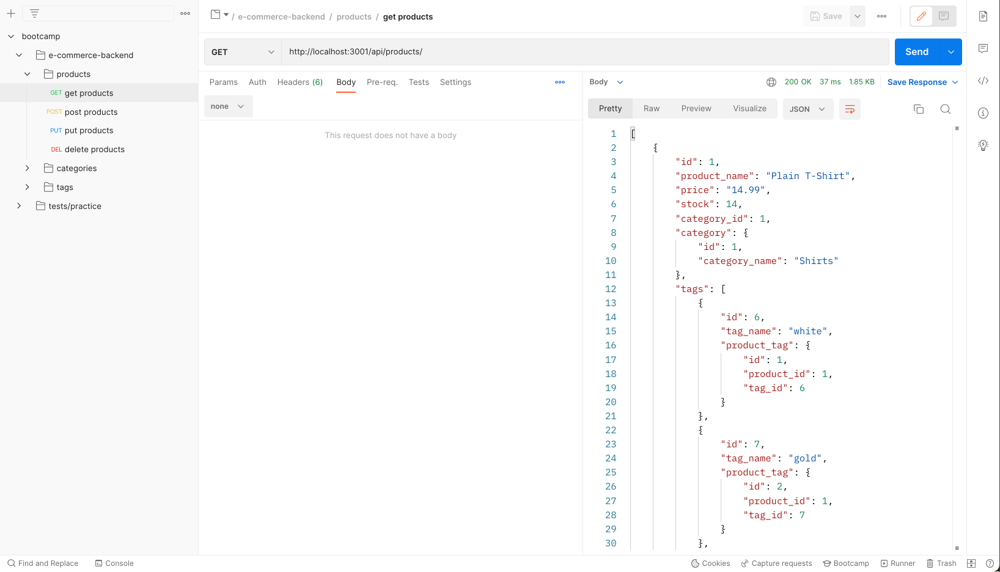
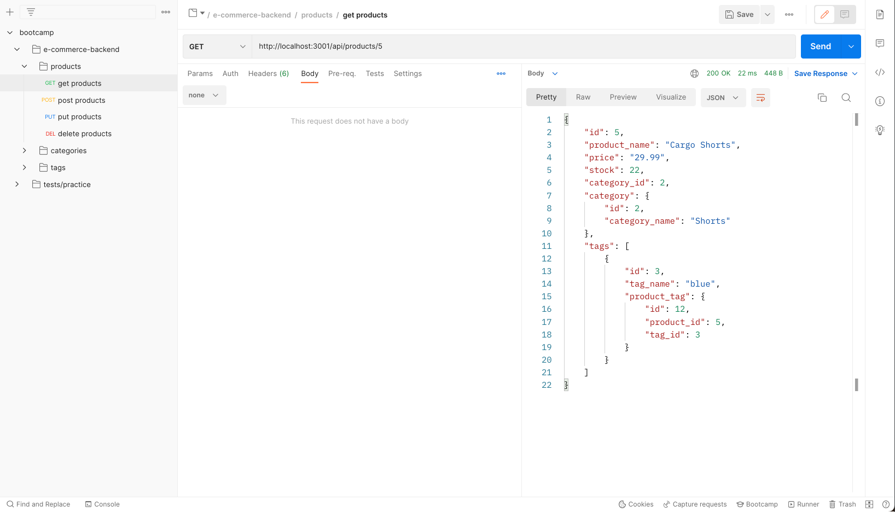

# e-commerce-backend

## Introduction
A SQL database and RESTful API work together to make a seamless and functional e-commerce backend. The project can be found [here](https://github.com/graycodesnu/e-commerce-backend) and the demo video can be found [here](https://watch.screencastify.com/v/mmAdMHdYuMwKfneXa7Vk).
 

## Goals 
The goal of this assignment was to create a backend for an e-commerce website meeting the below criteria:

+ Uses MySQL and Sequelize
+ Command line is used to seed test data and invoke the application and synced to the MySQL database
+ API routes utilize GET, POST, PUT, and DELETE in order to configure data accordingly

## Results 
I thoroughly enjoyed the logic that this assignment required. Once I was able to get one route working, I was able to put together the other routes and their functions in order to update data accordingly. It was exciting to figure one piece of the puzzle out and see it all come together! Postman was originally tricky for me to figure out, but after spending a while in the app (and a few YouTube tutorials), I was able to familiarize myself with it and I can see why it's the app developers prefer over Insomnia.

The amount of files our backend work has required thusfar has also become much less intimidating now that I've been able to apply their functionality to this assignment. I'm excited to see how we'll be able to apply all of this to our upcoming project! 